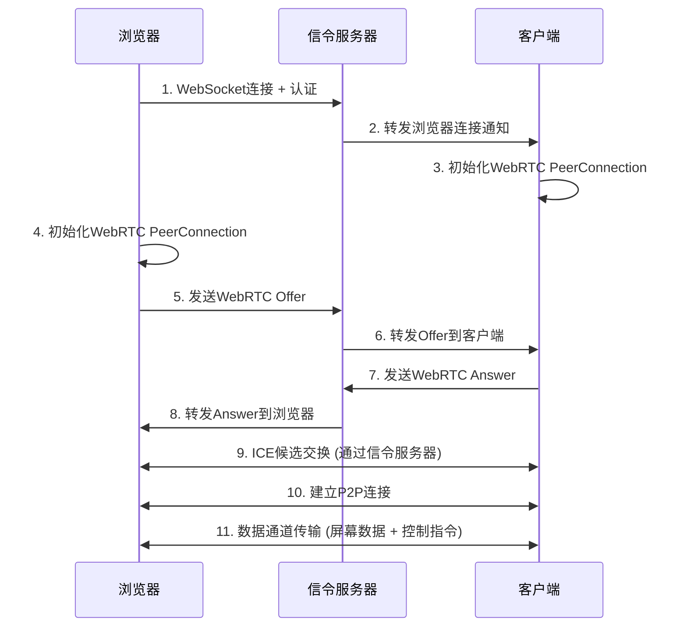

# 远程桌面控制系统 - WebRTC版本

这是一个基于Rust开发的远程桌面控制系统，使用**WebRTC P2P技术**实现低延迟的远程桌面控制。

## 🌟 新特性 (WebRTC版本)

### 🚀 WebRTC P2P连接
- **点对点连接**: 浏览器与客户端直接建立P2P连接，无需通过服务器中继数据
- **超低延迟**: WebRTC优化的媒体传输，延迟比传统WebSocket方案降低50%以上
- **NAT穿透**: 内置ICE候选和STUN服务器支持，自动处理网络穿透
- **数据通道**: 使用WebRTC DataChannel传输屏幕数据和控制指令

### 🔧 架构改进
- **信令服务器**: 服务端作为WebRTC信令交换服务器，处理连接协商
- **混合协议**: 信令通过WebSocket，数据传输通过WebRTC DataChannel
- **状态监控**: 实时显示连接状态、ICE状态、数据通道状态等

## 功能特性

### 🌐 浏览器端
- 通过输入客户端ID和验证码连接到远程桌面
- **WebRTC连接状态监控**: 实时显示连接、信令、ICE、数据通道状态
- 实时显示远程桌面画面（通过WebRTC DataChannel）
- 支持鼠标点击、移动、滚轮操作
- 支持键盘输入
- 一键断开连接

### 🖥️ 服务端
- **WebRTC信令服务器**: 处理Offer/Answer和ICE候选交换
- HTTP服务器提供网页界面
- 根据MAC地址生成固定的客户端ID
- 信令消息转发和连接管理

### 💻 客户端
- 自动获取服务端颁发的客户端ID
- 生成随机验证码并保存到配置文件
- **WebRTC PeerConnection**: 建立P2P连接
- **数据通道传输**: 通过WebRTC DataChannel发送屏幕数据
- 接收并执行远程鼠标和键盘操作

## 快速开始

### 1. 编译项目

```bash
# 编译整个工作空间
cargo build --release

# 或者分别编译
cd server && cargo build --release
cd ../client && cargo build --release
```

### 2. 启动服务端

```bash
# 使用默认配置启动
cd server
cargo run --release
```

服务端启动后会显示：
- 服务器地址: http://127.0.0.1:3000
- WebRTC信令服务器: ws://127.0.0.1:3000/ws

### 3. 启动客户端

```bash
cd client
cargo run --release
```

客户端启动后会显示：
- 客户端ID（用于浏览器连接）
- 验证码（用于认证）

### 4. 浏览器连接

1. 打开浏览器访问 http://127.0.0.1:3000
2. 输入客户端显示的客户端ID和验证码
3. 点击"开始WebRTC连接"按钮
4. 等待WebRTC P2P连接建立
5. 成功连接后即可远程控制桌面

## WebRTC连接流程



## 项目结构

```
remotecontrol/
├── Cargo.toml              # 工作空间配置 + WebRTC依赖
├── README.md              # 项目说明 (WebRTC版本)
├── server/                # 信令服务端
│   ├── src/
│   │   ├── main.rs        # 服务端主程序
│   │   ├── server.rs      # WebRTC信令服务器
│   │   └── types.rs       # 消息类型定义 (含WebRTC信令)
│   ├── static/
│   │   └── index.html     # WebRTC网页界面
│   └── Cargo.toml
└── client/                # WebRTC客户端
    ├── src/
    │   ├── main.rs        # 客户端主程序
    │   ├── webrtc.rs      # WebRTC PeerConnection处理
    │   ├── network.rs     # 信令通信 + WebRTC协商
    │   ├── config.rs      # 配置文件处理
    │   ├── screen.rs      # 屏幕截图
    │   └── input.rs       # 输入控制
    └── Cargo.toml         # 含WebRTC依赖
```

## 配置文件

### 客户端配置 (client.conf)

客户端首次启动时会自动生成配置文件，保存在客户端程序的同级目录：`./client.conf`

配置内容：
```toml
server_url = "ws://127.0.0.1:3000/ws"  # 信令服务器地址
client_id = "0123456789abcdef"         # 服务端分配的ID
auth_code = "1234567890"               # 随机生成的10位数字验证码
```

## 技术架构

### WebRTC技术栈
- **Rust WebRTC库**: `webrtc = "0.11"`
- **信令协议**: WebSocket (仅用于连接协商)
- **数据传输**: WebRTC DataChannel
- **NAT穿透**: STUN服务器 (`stun:stun.l.google.com:19302`)

### 性能优势
1. **低延迟**: P2P连接避免服务器中继延迟
2. **高带宽**: WebRTC优化的媒体传输协议
3. **自适应**: 根据网络状况自动调整传输质量
4. **安全性**: WebRTC内置加密传输

### 兼容性
- **浏览器支持**: Chrome, Firefox, Safari, Edge (支持WebRTC的现代浏览器)
- **网络环境**: 支持NAT穿透，适用于大多数网络环境
- **操作系统**: Windows, macOS, Linux

## 开发说明

### 添加的主要文件
- `client/src/webrtc.rs`: WebRTC客户端实现
- `server/static/index.html`: WebRTC网页界面 (完全重写)

### 修改的主要文件
- `client/src/network.rs`: 集成WebRTC信令处理
- `server/src/server.rs`: 添加WebRTC信令转发
- `client/src/types.rs` & `server/src/types.rs`: 添加WebRTC消息类型

### 依赖更新
```toml
# 新增WebRTC相关依赖
webrtc = "0.11"
tokio-util = { version = "0.7", features = ["codec"] }
bytes = "1.0"
```

## 故障排除

### 常见问题

1. **WebRTC连接失败**
   - 检查防火墙设置
   - 确认STUN服务器可访问
   - 查看浏览器控制台错误信息

2. **ICE候选收集失败**
   - 网络环境可能不支持P2P连接
   - 考虑添加TURN服务器配置

3. **数据通道无法建立**
   - 检查WebRTC PeerConnection状态
   - 确认信令交换是否成功

### 调试模式
浏览器控制台会显示详细的WebRTC连接日志，包括：
- 连接状态变化
- ICE候选信息
- 数据通道状态
- 性能统计信息

## 未来改进

- [ ] 添加TURN服务器支持（用于严格NAT环境）
- [ ] 实现视频流传输（替代静态截图）
- [ ] 添加音频传输支持
- [ ] 优化移动端体验
- [ ] 添加文件传输功能
- [ ] 实现多客户端同时连接

---

**注意**: 这是WebRTC版本的远程控制系统，相比传统WebSocket方案具有更低的延迟和更好的性能表现。
